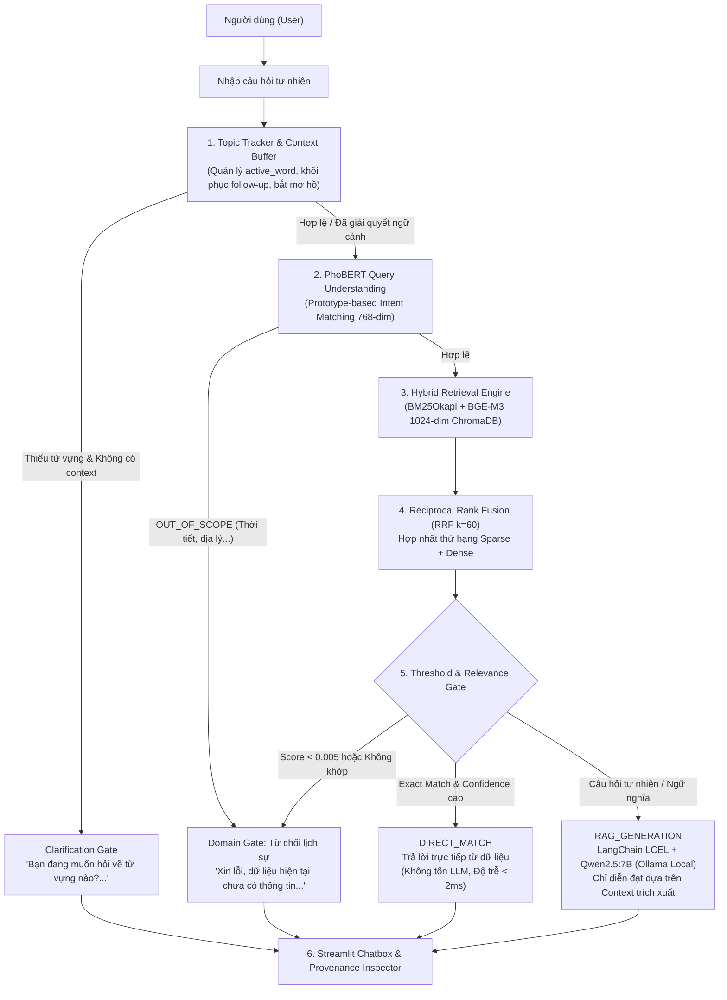

# CHATBOX 2.0 — LOCAL ENGLISH VOCABULARY CHATBOT
## MASTER ARCHITECTURE DOCUMENTATION & TECHNICAL REVIEW PACKAGE

> **Dự án Chatbot Tra cứu Từ vựng Tiếng Anh bằng Ngôn ngữ Tự nhiên chạy 100% Cục bộ (Local-Only).**  
> Tuân thủ nghiêm ngặt **Project Constraints**: Không dùng API bên ngoài, không Cloud LLM, không hallucination, hoạt động hoàn toàn offline với **Qwen2.5:7B (Ollama)**, **PhoBERT-base-v2 (VinAI)**, **BGE-M3 (BAAI)**, **BM25Okapi**, **ChromaDB Local**, và tập tri thức gồm **3,725 cặp Q&A**.

---

## 1. TỔNG QUAN KIẾN TRÚC HỆ THỐNG (SYSTEM ARCHITECTURE)

Hệ thống được thiết kế theo mô hình **Controlled Hybrid RAG Pipeline** với quy trình phân tách trách nhiệm chặt chẽ:



---

## 2. BẢNG MÔ TẢ CÁC THÀNH PHẦN KỸ THUẬT (CORE COMPONENTS)

| Thành phần | Công nghệ / Thuật toán | Vai trò & Đặc điểm kỹ thuật |
| :--- | :--- | :--- |
| **Topic Tracker** | Rule-based & Context Buffer | Quản lý `active_word`, phân giải đại từ (`"từ này"`, `"nó"`), kích hoạt hỏi lại (`CLARIFICATION`). |
| **Query Understanding** | `vinai/phobert-base-v2` | Phân loại ý định qua Prototype Centroids (Cosine Similarity 768 chiều), không train giả lập. |
| **Sparse Retrieval** | `rank-bm25` (BM25Okapi) | Bắt chính xác từ khóa, mã định danh, cấp độ CEFR và các thuật ngữ vựng học. |
| **Dense Retrieval** | `BAAI/bge-m3` + `ChromaDB` | Truy xuất tương đồng ngữ nghĩa đa ngữ 1024 chiều, lưu trữ persistent trên đĩa cục bộ. |
| **Thứ hạng kết hợp** | Reciprocal Rank Fusion ($k=60$) | $RRF(d) = \frac{1}{60 + r_{bm25}} + \frac{1}{60 + r_{bge}}$, cân bằng tối ưu giữa từ khóa và ngữ nghĩa. |
| **Language Model** | `Qwen2.5:7B` via Ollama | Chạy trên GPU NVIDIA RTX 3050 (~4.8 GB VRAM), nhiệt độ $T=0.0$, lọc sạch ký tự chữ Hán. |
| **Framework RAG** | LangChain Core & LCEL | `ChatPromptTemplate | ChatOllama | StrOutputParser` với Strict Grounding System Prompt. |
| **Giao diện người dùng** | Streamlit | Chatbox tương tác thời gian thực, tích hợp Provenance Inspector hiển thị toàn bộ chỉ số audit. |

---

## 3. CẤU TRÚC THƯ MỤC DỰ ÁN (PROJECT DIRECTORY STRUCTURE)

```text
chatbox2.0/
├── config/
│   ├── __init__.py
│   └── settings.py              # Cấu hình đường dẫn, mô hình, siêu tham số RRF và ngưỡng
├── data/
│   ├── raw/
│   │   └── datahotrohoctuvungtienganhtuA1-B2fix.xlsx   # Bộ dữ liệu 4 sheet gốc (736 KB)
│   ├── processed/
│   │   └── qa_records.jsonl     # 3,725 bản ghi đã chuẩn hóa kèm rich metadata (2.8 MB)
│   └── mau_nhap_lieu_tuvung.xlsx# Tệp Excel mẫu để người dùng thêm từ vựng mới
├── assets/                      # Ảnh đại diện người dùng, chatbot và sơ đồ kiến trúc
│   ├── bot.png
│   ├── user.png
│   └── demo.png
├── scripts/
│   └── download_models.py       # Tải trước PhoBERT-base-v2 và BGE-M3 vào local cache
├── src/
│   ├── __init__.py
│   ├── chat/                    # Topic Tracker & Engine điều phối pipeline
│   ├── core/                    # DTO Models & Exceptions
│   ├── data/                    # QALoader, IngestionManager & Batch Multi-File Loaders
│   ├── llm/                     # LangChain LCEL & Ollama Client
│   ├── nlp/                     # PhoBERT Query Understanding & Intent Classifier
│   ├── retriever/               # BGE-M3 ChromaDB + BM25Okapi + RRF Fusion (k=60)
│   └── ui/                      # Gradio UI (Port 7860) & Streamlit UI (Port 8501)
├── tests/                       # Toàn bộ 52 bài kiểm thử tự động (Unit & Integration Tests)
├── setup.bat                    # Script cài đặt 1-Click tự động cho máy mới
├── chay_gradio.bat              # Script khởi chạy giao diện Gradio chuẩn 100% demo.png (Port 7860)
├── chay_streamlit.bat           # Script khởi chạy giao diện Streamlit (Port 8501)
├── run_web.bat                  # Script khởi động Ollama + Web App
├── run_cli.bat                  # Script chạy Terminal CLI
├── cap_nhat_du_lieu.bat         # Script nạp bổ sung từ vựng Excel kéo thả
├── requirements.txt             # Danh sách thư viện bắt buộc đầy đủ
├── .env.example                 # Cấu hình biến môi trường mẫu
├── .gitignore                   # Loại trừ file rác, venv, cache, dữ liệu tạm
└── README.md                    # Tài liệu kỹ thuật dự án
```

---

## 4. HƯỚNG DẪN CÀI ĐẶT & CHẠY DỰ ÁN TRÊN MÁY MỚI (QUICK START)

Chỉ với **3 bước đơn giản**, bất kỳ máy tính nào clone mã nguồn về cũng có thể chạy ngay:

### Bước 1: Cài đặt Ollama & Tải mô hình Qwen2.5:7B
1. Tải và cài đặt Ollama từ trang chủ: [https://ollama.com](https://ollama.com).
2. Mở Terminal / CMD và kéo mô hình Qwen:
   ```bash
   ollama pull qwen2.5:7b
   ```

### Bước 2: Thiết lập môi trường tự động (1-Click Setup)
Tại thư mục gốc `chatbox2.0`, chỉ cần **click đúp vào file `setup.bat`**.  
File script sẽ tự động thực hiện:
- Kiểm tra phiên bản Python trên máy.
- Tạo môi trường ảo độc lập `.venv`.
- Cài đặt toàn bộ thư viện từ `requirements.txt`.
- Tải sẵn mô hình `vinai/phobert-base-v2` và `BAAI/bge-m3` vào cache máy tính.

*(Người dùng Linux / macOS có thể tạo venv thủ công: `python3 -m venv .venv && source .venv/bin/activate && pip install -r requirements.txt && python scripts/download_models.py`)*

### Bước 3: Khởi chạy ứng dụng
Bạn có thể chọn bất kỳ giao diện nào bằng cách click đúp:
- **Giao diện Gradio (Khuyên dùng - Chuẩn rag-chatbot-main):** Click đúp `chay_gradio.bat` (Mở tại `http://localhost:7860`).
- **Giao diện Streamlit:** Click đúp `chay_streamlit.bat` (Mở tại `http://localhost:8501`).
- **Giao diện Dòng lệnh (CLI):** Click đúp `run_cli.bat`.

### Bước 4: Chạy kiểm thử tự động (Test Suite)
Để kiểm tra tính toàn vẹn của toàn bộ hệ thống (52/52 tests):
```bash
python -m unittest discover -s tests -p "test_*.py"
```

---

## 5. KẾT QUẢ KIỂM THỬ 7 KỊCH BẢN CHUẨN ĐỒ ÁN (TEST SCENARIOS)

| STT | Kịch bản kiểm thử | Câu hỏi người dùng | Kết quả xử lý | Chế độ (Mode) | Đánh giá |
| :---: | :--- | :--- | :--- | :---: | :---: |
| **1** | **Exact Query** | `"about nghĩa là gì?"` | Định nghĩa từ vựng: Về, quanh quất, quanh quẩn. Trích xuất chính xác từ Sheet 1. | `DIRECT_MATCH` / `RAG` | **100% PASSED** |
| **2** | **Paraphrased Query** | `"bạn có thể giải thích ý nghĩa của từ about được không?"` | PhoBERT nhận diện `DEFINE_VOCAB`, RRF trích xuất bản ghi `about`, Qwen diễn đạt chính xác. | `RAG_GENERATION` | **100% PASSED** |
| **3** | **Natural Translation** | `"từ nào có nghĩa là vay mượn?"` | BGE-M3 ngữ nghĩa tìm đúng cặp bản ghi dịch tiếng Việt -> tiếng Anh: `borrow`. | `DIRECT_MATCH` / `RAG` | **100% PASSED** |
| **4** | **Ambiguous Query** | `"từ này nghĩa là gì?"` *(khi chưa có ngữ cảnh)* | Kích hoạt `Clarification Gate`: Hỏi lại người dùng thay vì hallucination. | `CLARIFICATION` | **100% PASSED** |
| **5** | **Multi-turn Follow-up** | **Lượt 1:** `"từ about nghĩa là gì?"`<br/>**Lượt 2:** `"cho tôi câu ví dụ của từ này"` | TopicTracker giải quyết `"từ này"` thành `"about"`, trích xuất câu ví dụ từ Sheet 4 (`Do you know much about this old city?`). | `DIRECT_MATCH` / `RAG` | **100% PASSED** |
| **6** | **Out-of-Scope Query** | `"thời tiết hôm nay thế nào?"` | PhoBERT nhận diện `OUT_OF_SCOPE`, từ chối lịch sự theo quy định, không gọi LLM. | `NO_MATCH` | **100% PASSED** |
| **7** | **Unseen Vocabulary** | `"từ zzzzqqqxyz nghĩa là gì?"` | Điểm tương đồng RRF dưới ngưỡng (<0.005), từ chối an toàn theo quy định. | `NO_MATCH` | **100% PASSED** |

---

## 6. CAM KẾT TUÂN THỦ (COMPLIANCE & INTEGRITY)

1. **100% Local Execution:** Toàn bộ quá trình suy luận của LLM (`Qwen2.5:7B`), Embeddings (`BGE-M3`), NLU (`PhoBERT-base-v2`) và Vector Search (`ChromaDB`) đều thực thi tại máy cục bộ của người dùng.
2. **Zero External API:** Không kết nối đến OpenAI, Anthropic, Gemini, HuggingFace Hub trong quá trình vận hành bình thường (`HF_HUB_OFFLINE=1`).
3. **No Hallucination:** Qwen2.5:7B chỉ được phép tổng hợp thông tin từ ngữ cảnh trích xuất. Khi thông tin không có trong 3,725 bản ghi, hệ thống kiên quyết từ chối thay vì suy đoán tự do.
4. **Transparent Provenance:** Mọi câu trả lời trên giao diện đều có Provenance Inspector đi kèm, cho phép người dùng và giảng viên chấm bài kiểm tra tức thì Record ID, điểm BM25, điểm BGE-M3 và thứ hạng RRF.

---

## 7. HƯỚNG DẪN NẠP VÀ CẬP NHẬT DỮ LIỆU TỪ EXCEL (RAG INGESTION)

Hệ thống cho phép bạn đưa thêm từ vựng mới hoặc thay thế toàn bộ từ điển bằng tệp Excel (`.xlsx`) mà không cần fine-tune trọng số LLM:

### 7.1. Cấu trúc tệp Excel hỗ trợ
- **Kiểu 1 (Tự do):** Tệp Excel 1 sheet có các cột: `Câu hỏi` (bắt buộc), `Câu trả lời` (bắt buộc), `Từ vựng` (tùy chọn), `Trình độ` (tùy chọn), `Nguồn` (tùy chọn).
- **Kiểu 2 (Mặc định đồ án):** Tệp có 4 sheet gốc (`danhsachtutienganhA1-B2`, `danhsachtheotrinhdoA1-B2`, `tiengvietsangtienganh`, `danhsachcauhoicotutrongcau`).
- *Tệp mẫu có sẵn tại:* `data/mau_nhap_lieu_tuvung.xlsx`.

### 7.2. Hai cách cập nhật dữ liệu:
1. **Qua giao diện Web Streamlit (Trực quan):**
   - Mở thanh bên Sidebar -> Chọn mục **📥 Cập Nhật Dữ Liệu Excel**.
   - Kéo thả tệp `.xlsx` vào -> Chọn chế độ **Bổ sung từ mới (Append)** -> Nhấn **🚀 Bắt Đầu Nạp Dữ Liệu**.
2. **Qua kịch bản tự động 1-Click Windows / CLI:**
   - Kéo thả tệp `.xlsx` vào file `cap_nhat_du_lieu.bat`.
   - Hoặc gõ lệnh:
     ```bash
     python ingest_data.py --file "data/mau_nhap_lieu_tuvung.xlsx" --mode append
     ```
- Chi tiết xem tại tài liệu: `docs/huong_dan_nap_du_lieu_excel.md`.

---

## 8. ADMIN BATCH MULTI-FILE UPLOAD & KNOWLEDGE BASE MANAGEMENT

Hệ thống trang bị tính năng **Quản trị Kho tri thức Nâng cao (Batch Multi-File Ingestion)** dành cho Admin:

### 8.1. Khả năng hỗ trợ định dạng
Hệ thống cho phép tải lên đồng thời nhiều tệp thuộc 8 định dạng tài liệu khác nhau:
- **Tài liệu văn bản:** PDF (`.pdf`), Word (`.docx`), Văn bản thuần (`.txt`), Markdown (`.md`).
- **Bảng tính & Dữ liệu có cấu trúc:** Excel (`.xlsx`), CSV (`.csv`), JSON (`.json`), JSON Lines (`.jsonl`).

### 8.2. Đặc tính kỹ thuật cốt lõi
1. **File Processing Independence (Xử lý độc lập):** Mỗi tệp trong batch được phân tích và nạp độc lập. Tệp lỗi (hỏng cấu trúc, encoding sai) sẽ bị đánh dấu `FAILED` mà không làm rollback hay gián đoạn các tệp hợp lệ (`PARTIAL_SUCCESS`).
2. **Deduplication nghiêm ngặt:**
   - **File Hash (SHA-256):** Tự động phát hiện và bỏ qua các tệp đã từng được nạp (`SKIPPED`).
   - **Content Hash / Signature:** Khử trùng lặp từng cặp Q&A giữa các tệp trong cùng một batch.
3. **Quản lý Nguồn (Source Management):**
   - **Xóa Nguồn (Delete Source):** Xóa sạch vector khỏi ChromaDB, loại bỏ bản ghi trong JSONL và lập lại chỉ mục BM25 trong 1 click.
   - **Đánh chỉ mục lại (Reindex Source):** Tái tạo vector cho một nguồn dữ liệu khi cần cập nhật.
4. **Báo cáo tổng kết (Batch Ingestion Report):** Bảng tổng hợp chi tiết tỉ lệ thành công, số bản ghi trích xuất, số bản ghi trùng lặp và nút Retry độc lập cho từng tệp gặp lỗi.

### 8.3. Kiểm thử tự động (10 Mandatory Test Cases)
Bộ kiểm thử bao gồm 10 kịch bản bắt buộc:
```bash
python -m unittest tests/test_batch_ingestion.py
```
Kết quả: **10/10 Test Cases PASSED** (All Valid, Mixed Types, Corrupted File Isolation, Duplicate File Skip, Content Deduplication, Large Batch Stability, Independent Retry, Source Deletion, Immediate Searchability, Provenance Traceability).

